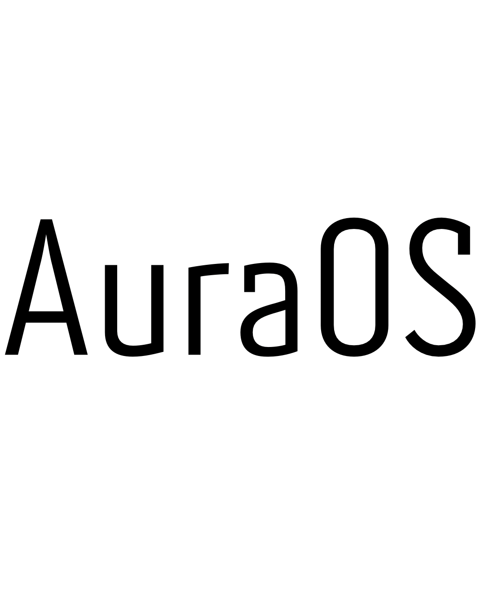

  <pre style="color:#00FFFF; background-color:#000000; border-radius:10px; padding:10px;">
     ___                       ___   _____
    /   |  ____ ___  ____ ___ /   | /  _  \
   / /| | / __ `__ \/ __ `__ \/ /| |/  /_\  \
  / ___ |/ / / / / / / / / / / ___ /    |    \
 /_/  |_/_/ /_/ /_/_/ /_/ /_/_/  |_|\____|__  /
                                           \/ 
  </pre>

  

<h1 align="center">🌌 AuraOS</h1>

  <b>O melhor sistema operacional baseado em BSD e Linux — moderno, rápido e open source.</b>

---

## 📂 Estrutura de Pastas

### 🔴 arm64/
Contém código em **assembly** para inicialização da arquitetura ARM64:
- `cpu_init.S` → Inicializa CPU, registradores, stack e MMU.
- `stack_init.S` → Configura stack pointer do kernel.
- `memory_init.S` → Inicializa memória, MMU e cache.
- `exception_vector.S` → Vetores de exceção ARM64.
- `boot_entry.S` → Ponto de entrada `_start`, chama CPU, vetores e bootloader.

### 🟠 automation_testing/
Scripts e código para **testes automáticos** do sistema.

### 🟡 bootloader/
Arquivos responsáveis pelo **boot do sistema** e seleção de modo de inicialização.

### 🟢 debug_mode/
Modo de debug, mostrando todos os logs do sistema e permitindo testes avançados.

### 🔵 seven_ui/
Interface **Seven UI** do AuraOS:
- `logic/` → Lógica da UI.
- `widgets/` → Componentes visuais.
- `input/` → Gerencia entradas do usuário.

### 🟣 NFC/
Integração com hardware NFC.

### 🟤 pico_tts/
Módulo TTS (Text-to-Speech) para AuraOS.

### ⚫ kernel/
Código do kernel, incluindo:
- `BSD/` → Componentes baseados em BSD.
- `panic/` → Kernel panic com cores RGB.
- `logUI/` → Exibe todos os logs do kernel.

### ⚪ open_source/
Exibe código aberto do AuraOS para usuários.

### 🔵 reboot/
Reinicia o sistema.

### 🟢 recovery/
Modo recovery com múltiplas opções para manutenção.

### 🟡 alert_system/
Sistema de alertas do governo com cores e animações RGB.

### 🔴 no_main/
Fallback do sistema quando o `main` não funciona.

### 🟠 main/
Contém `main.c` e `main.cpp`, ponto de compilação principal do AuraOS, que integra todos os módulos da pasta `Source`.

### 🟣 vendor/
Código de fornecedores e bibliotecas de terceiros.

---

## 📌 Observações

- Todos os arquivos estão **modulares**, permitindo atualização e manutenção fácil.  
- O **bootloader** chama `_start` em `boot_entry.S`, que inicializa CPU, memória, vetores de exceção e finalmente o kernel.  
- Os módulos podem ser ativados ou desativados via `sys_config_factory.cfg`.

---

## ⚡ Links úteis

  
  
  
  
  
  

---

## 📝 Créditos e Licença

- Desenvolvido por **Gabriel / Enzo**  
- Licenciado sob **MIT / BSD / Open Source**  
- Respeita licenças de código de terceiros presentes na pasta `vendor/`  
- Todos os módulos são de código aberto e podem ser modificados e redistribuídos conforme licenças.

---

  🌟
  🌟
  🌟
  🌟
  🌟
  🌟

**Sistema:** AuraOS – Open Source, modular e para aprendizado.
